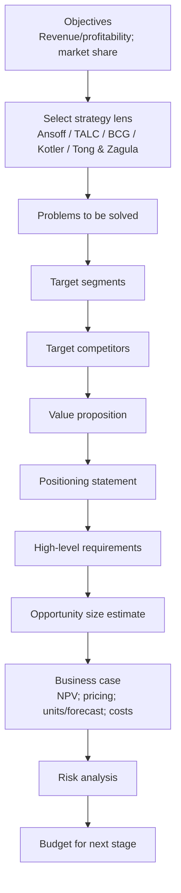

```mermaid
flowchart TB
  O[Objectives<br/>Revenue/profitability; market share] --> L[Select strategy lens<br/>Ansoff / TALC / BCG / Kotler / Tong & Zagula]
  L --> P[Problems to be solved]
  P --> S[Target segments]
  S --> C[Target competitors]
  C --> VP[Value proposition]
  VP --> POS[Positioning statement]
  POS --> R[High-level requirements]
  R --> SZ[Opportunity size estimate]
  SZ --> BC[Business case<br/>NPV; pricing; units/forecast; costs]
  BC --> RSK[Risk analysis]
  RSK --> BUD[Budget for next stage]
```
