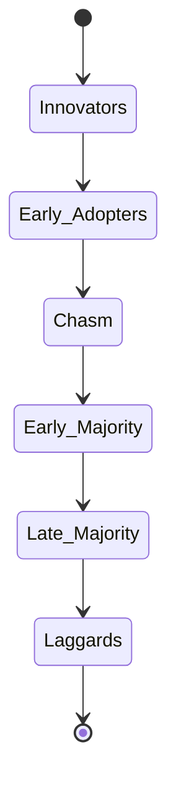

```mermaid
stateDiagram-v2
  [*] --> Innovators
  Innovators --> Early_Adopters
  Early_Adopters --> Chasm
  Chasm --> Early_Majority
  Early_Majority --> Late_Majority
  Late_Majority --> Laggards
  Laggards --> [*]
```
